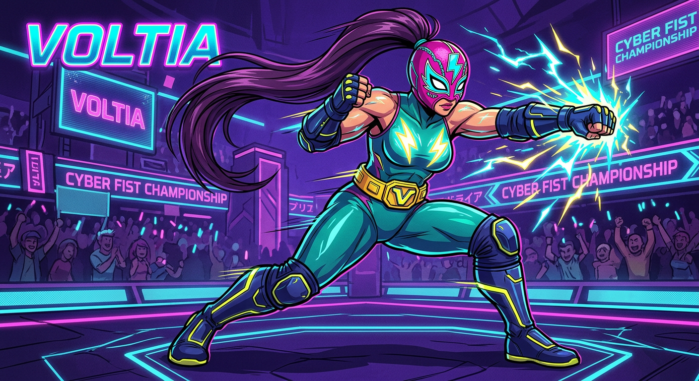
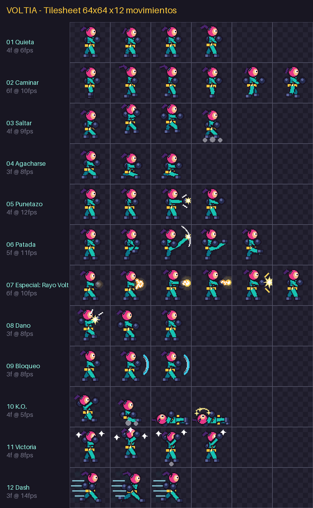

# FabaterFighter

Juego de peleas 2D. Primer personaje jugable: **VOLTIA**, la luchadora voltaje. ⚡🦹‍♀️



## Tilesheet de Voltia

- Sprites de **64×64** (un paso más grande que los clásicos 32/48), fondo transparente.
- Hoja: `assets/voltia_spritesheet.png` (384×768, 6 columnas × 12 filas).
- Metadatos para el motor: `assets/voltia_spritesheet.json` (fila, nº de frames, fps y loop por animación).
- Frames sueltos: `assets/frames/voltia_<anim>_<n>.png`.
- Vista previa etiquetada: `assets/voltia_preview.png`.



### Movimientos (12)

| # | Animación | Frames | FPS | Loop |
|---|-----------|--------|-----|------|
| 01 | Quieta | 4 | 6 | sí |
| 02 | Caminar | 6 | 10 | sí |
| 03 | Saltar | 4 | 9 | no |
| 04 | Agacharse | 3 | 8 | sí |
| 05 | Puñetazo | 4 | 12 | no |
| 06 | Patada | 5 | 11 | no |
| 07 | Especial: Rayo Volt | 6 | 10 | no |
| 08 | Daño | 3 | 8 | no |
| 09 | Bloqueo | 3 | 8 | sí |
| 10 | K.O. | 4 | 5 | no |
| 11 | Victoria ✨ nuevo | 4 | 8 | sí |
| 12 | Dash ✨ nuevo | 3 | 14 | sí |

### Visor animado

Abre `preview/index.html` en un servidor local (p. ej. `python3 -m http.server` en la raíz
y visita `/preview/`) para ver cada animación, cambiar la escala y comprobar la transparencia.

### Regenerar / modificar

Los sprites son 100 % procedurales (pixel-art dibujado por código, sin IA), así que puedes
ajustar poses, paleta o añadir movimientos editando el generador:

```bash
pip install pillow
python3 tools/generate_spritesheet.py
```

Todo el arte de `assets/` es original y creado para este proyecto.
